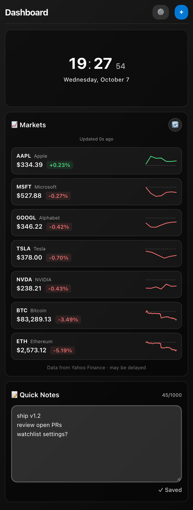

# Widget Dashboard for VS Code

[](https://marketplace.visualstudio.com/items?itemName=soohumkaushik.vscode-widget-dashboard)
[](https://marketplace.visualstudio.com/items?itemName=soohumkaushik.vscode-widget-dashboard)
[](https://github.com/SoohumKaushik/vscode-widget-dashboard/actions/workflows/ci.yml)
[](./LICENSE)

An iOS-style widget dashboard that lives in your VS Code sidebar: a clock, live
market quotes, sports scores, your GitHub activity, a notes scratchpad, and
ambient sounds, stacked in one column you can rearrange.

<p align="center">
  
</p>

## Install

- **Marketplace:** search for **Widget Dashboard** in the Extensions view, or
  [install it from the Visual Studio Marketplace](https://marketplace.visualstudio.com/items?itemName=soohumkaushik.vscode-widget-dashboard).
- **Command line:** `code --install-extension soohumkaushik.vscode-widget-dashboard`

Then click the **Widget Dashboard** icon in the Activity Bar.

## Widgets

| Widget | What it does |
| --- | --- |
| ⏰ **Clock** | Live time and date |
| 📈 **Markets** | Live stock and crypto quotes with intraday sparklines (Yahoo Finance) |
| 🏈 **Live Sports** | Live NFL and NBA scores (ESPN) |
| 🐙 **GitHub Activity** | Your notifications, pull requests, and assigned issues |
| 📝 **Quick Notes** | A scratchpad that auto-saves as you type |
| 🎵 **Ambient Sounds** | Rain, ocean, fireplace, forest, and wind loops with a volume control |

## Usage

- **Add a widget:** click **+ Add Widget** (or run *Widget Dashboard: Add Widget*
  from the Command Palette) and pick one from the gallery.
- **Rearrange or remove:** click **Edit**, drag widgets into the order you want,
  use the red **×** to remove one, then click **Done**.
- Your layout and notes are saved between sessions.

Widgets always stack in a single column. If you drag the sidebar wider or move
the view into the panel, the column stays centered at a readable width.

### About the market data

Quotes come from Yahoo Finance's public chart endpoint and refresh once a
minute. Stocks show the change since the previous close. Crypto shows the
change over the last 24 hours, matching what exchanges and Yahoo's own quote
pages display. The sparkline's dashed line marks the price the change is
measured from. Data may be delayed and is for information only — don't trade
on it.

### GitHub sign-in

The **GitHub Activity** widget asks you to sign in with GitHub the first time.
It requests only the `read:user` and `notifications` scopes. Your access token
stays inside the extension host and is never exposed to the dashboard UI.

## Privacy & network access

The extension only talks to:

- `query1.finance.yahoo.com`: market quotes (Markets widget)
- `site.api.espn.com`: sports scores (Live Sports widget)
- `api.github.com`: your GitHub activity, only after you sign in (GitHub widget)
- `assets.mixkit.co`: ambient sound files (Ambient Sounds widget)

There's no analytics or telemetry, and nothing is sent anywhere else.

## Contributing

Contributions are welcome, whether that's a new widget, a bug fix, or a design
tweak. See [CONTRIBUTING.md](./CONTRIBUTING.md) for setup and guidelines, and
browse [open issues](https://github.com/SoohumKaushik/vscode-widget-dashboard/issues)
for ideas.

Quick start:

```bash
git clone https://github.com/SoohumKaushik/vscode-widget-dashboard.git
cd vscode-widget-dashboard
npm install
npm run build
```

Then open the folder in VS Code and press `F5` to launch an Extension
Development Host with the extension loaded.

## Roadmap

- [ ] Customizable watchlist for the Markets widget
- [ ] Pomodoro timer widget
- [ ] Weather widget
- [ ] Calendar / events widget
- [ ] Per-widget settings
- [ ] Export / import dashboard layouts

## Credits

Ambient sounds are streamed from [Mixkit](https://mixkit.co/) under the Mixkit
free license. Market data from Yahoo Finance, scores from ESPN. This project
isn't affiliated with or endorsed by any of them.

## License

[MIT](./LICENSE) © Soohum Kaushik
